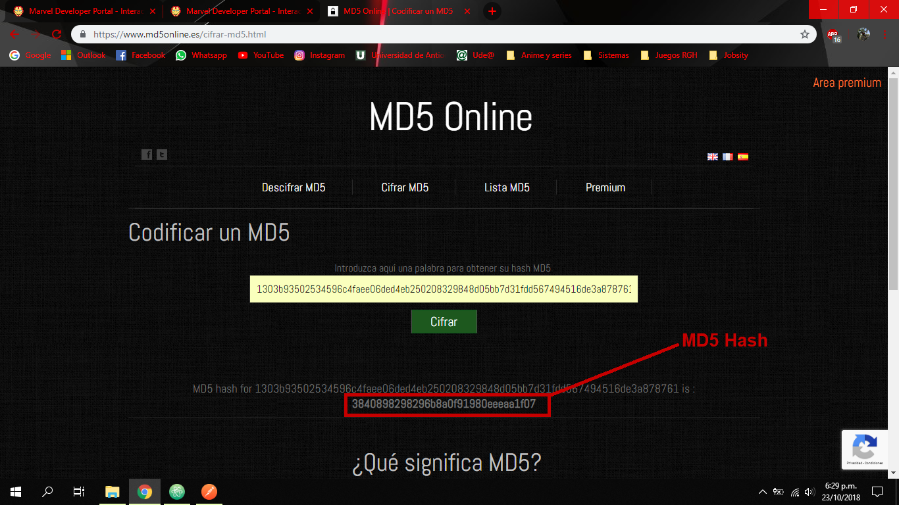
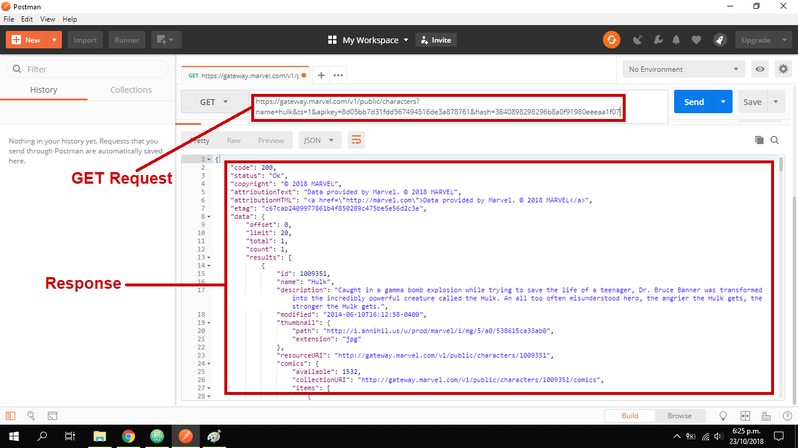
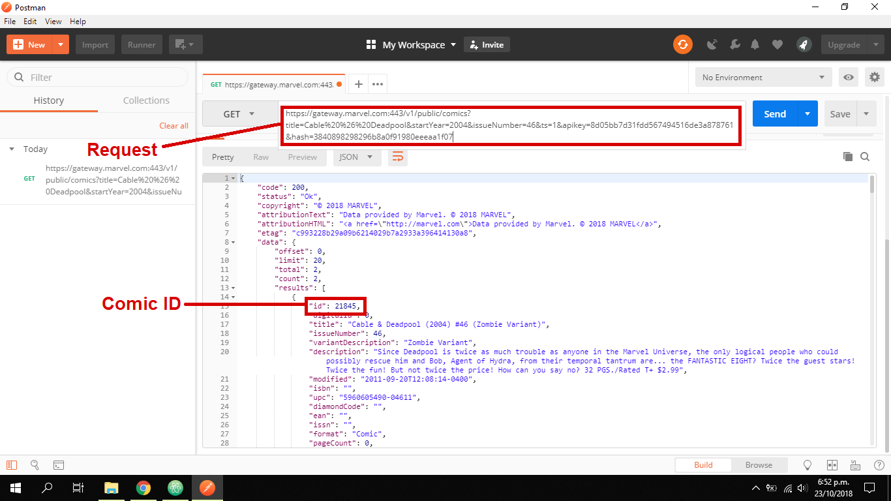
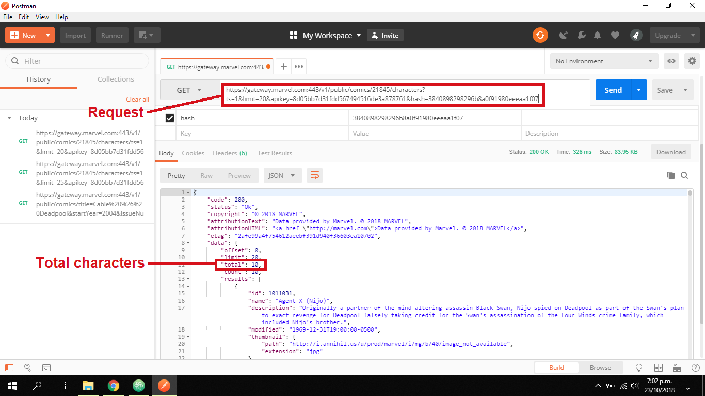
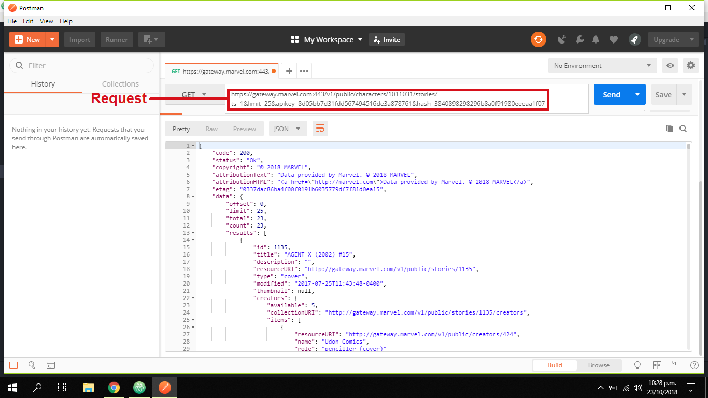

## Challenge C02
In this document are described the steps to complete the RESTful APIs and HTTP
requests challenge.
___
1. **Get API key**  
Access to https://developer.marvel.com/docs and register to get an account,
after that you will get a public and private API key. To make a request is also
necessary to obtain a MD5 hash, I created it with https://www.md5online.es/cifrar-md5.html
it's only necessary to put (ts+privatekey+publickey) and the tool will generate
the MD5 hash.  

___
2. **Download postman and get information for a superhero from Marvel API**  
I use a request to search "hulk" into character by the name.
[You can see complete response clicking here](JSON/Hulk.json).  

___
3. **Cable & Deadpool #46 Characters**  
To get information related to the list of characters of Cable & Deadpool
(2004) #46 (Zombie Variant) I search first the comic ID with a request
  
And after that i search the characters inside it.
[You can see complete response clicking here](JSON/CableDeadpoolCharacters.json).  

___
4. **Agent X stories**
To get a list of all stories when Agent X (Nijo) appears got his ID from
[Cable & Deadpool (2004) #46](JSON/CableDeadpoolCharacters.json) and used in the
following request.
[You can see complete response clicking here](JSON/AgentXStories.json).  

